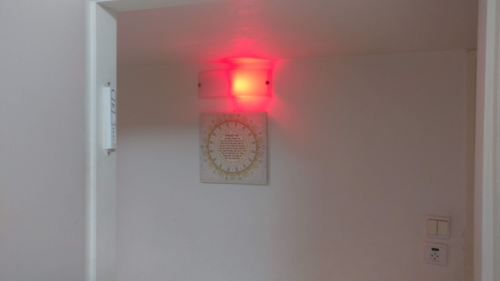
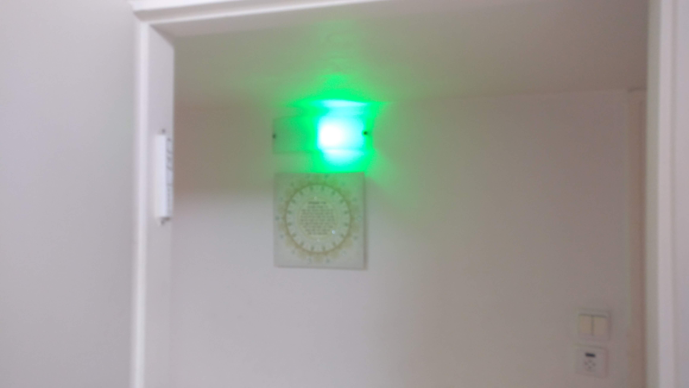
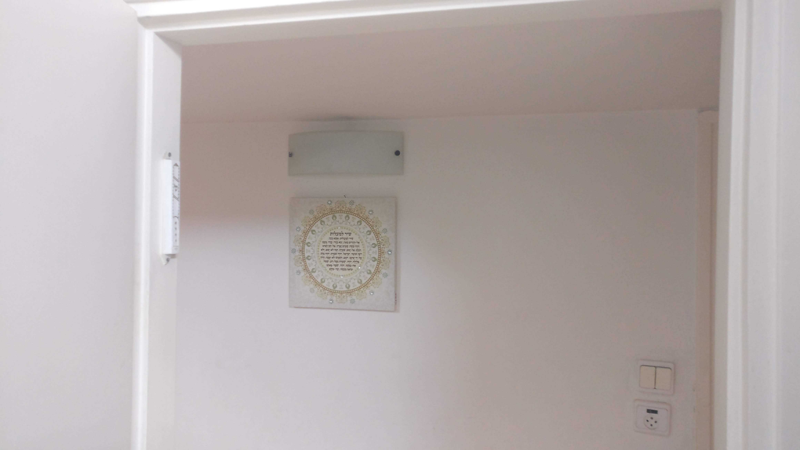

# InMeeting Light

## Control Yeelight blub according to your Google Calendar meetings importance.

InMeeting-Light is running each 5 minutes, connect to your Google Calendar , fetch events and check if now ( or in 10 minutes ) you have a meeting.
InMeeting-Light is also setting the bulb color according to your Google Calendar meetings importance.


Yeelight blub - in important meeting



Yeelight blub - can enter room



Yeelight blub Off



### customization of the code is super-easy :

```
def in_meeting_logic(meeting_found,attendees_found,attendees_out_of_company_found):
	
	if attendees_out_of_company_found:
		bulb_light("on",255,0,0) 		# red

	elif attendees_found:
		bulb_light("on",0,128,0) 		# green

	elif meeting_found:
		bulb_light("off",0,0,0)

	else:
		bulb_light("off",0,0,0)

```

### Installation:

```
   [needs python 3]

   Yeelight installation
   https://yeelight.readthedocs.io/en/latest/
   - pip install yeelight
   - Enable LAN Access using Yeelight App

   Google Calendar API 
   - pip install dateutils
   - pip install --upgrade google-api-python-client google-auth-httplib2 google-auth-oauthlib
   - follow instructions in : https://developers.google.com/calendar/quickstart/python
   - Save credentials.json to the same folder.

   Add Linux["Cron"] or Windows["Task Scheduler"] : each 5 minutes.
```

